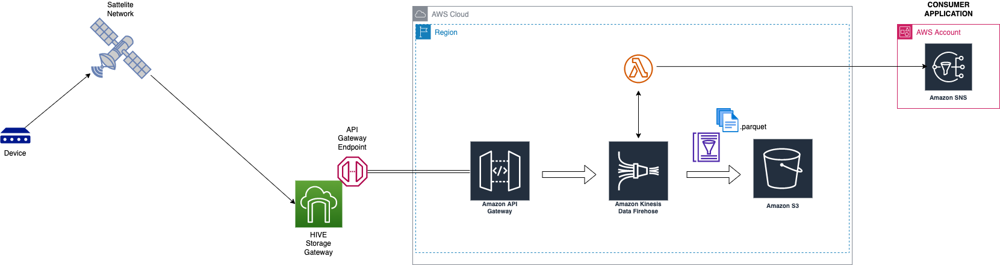

About the Project:

The approach implemented via AWS CDK was used in a solution implementation for an AWS customer working in space analytics domain.
They were using a third-party hive storage gateway where devices were sending over NMEA-0183 formatted messages to that third-party satellite network which downlinked those messages to the third-party hive gateway API endpoint.
The purpose of this implementation was to capture/ingest those device messages securely and near-real time into AWS data lake as well as provide a near-real-time alerting and ETL capability.

The following architecture will be implemented:



For the purpose of keeping code generic, The cross-account AWS SNS alerts are not part of the implementation and can be added as extension to CDK code.

# Welcome to your CDK Python project!

You should explore the contents of this project. It demonstrates a CDK app with an instance of a stack (`cdk_datalake_mvp_stack`)
which contains an Amazon SQS queue that is subscribed to an Amazon SNS topic.

The `cdk.json` file tells the CDK Toolkit how to execute your app.

This project is set up like a standard Python project.  The initialization process also creates
a virtualenv within this project, stored under the .venv directory.  To create the virtualenv
it assumes that there is a `python3` executable in your path with access to the `venv` package.
If for any reason the automatic creation of the virtualenv fails, you can create the virtualenv
manually once the init process completes.

To manually create a virtualenv on MacOS and Linux:

```
$ python3 -m venv .venv
```

After the init process completes and the virtualenv is created, you can use the following
step to activate your virtualenv.

```
$ source .venv/bin/activate
```

If you are a Windows platform, you would activate the virtualenv like this:

```
% .venv\Scripts\activate.bat
```

Once the virtualenv is activated, you can install the required dependencies.

```
$ pip install -r requirements.txt
```

At this point you can now synthesize the CloudFormation template for this code.

```
$ cdk synth
```

You can now begin exploring the source code, contained in the hello directory.
There is also a very trivial test included that can be run like this:

```
$ pytest
```

To add additional dependencies, for example other CDK libraries, just add to
your requirements.txt file and rerun the `pip install -r requirements.txt`
command.

## Useful commands

 * `cdk ls`          list all stacks in the app
 * `cdk synth`       emits the synthesized CloudFormation template
 * `cdk deploy`      deploy this stack to your default AWS account/region
 * `cdk diff`        compare deployed stack with current state
 * `cdk docs`        open CDK documentation

Once the stack is deployed, The codecommit step in pipeline will fail the first time since cdk is not able to create git branch for the repo.

After executing cdk deploy, Run the following commands in sequence (For the purpose of test, Use AWS cloud9 or linux based environment):

1) git init
2) git remote add origin <repository link>
3) git branch -m master main
4) git add .
5) git commit -m initver0
6) git push -u origin main

Enjoy !
